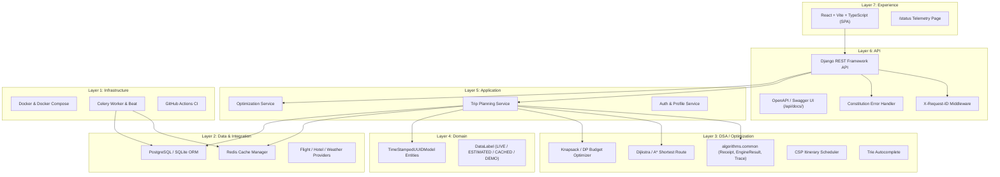

# Architecture Overview

This document describes the 7-layer architecture of the **TravelMind** system.

## Architectural Tenets

1. **AI is never the source of truth for deterministic constraints**: AI interprets prompts, while pure algorithmic engines compute budgets, shortest paths, and slot assignments.
2. **Layer isolation**: `algorithms/` is pure Python and never imports Django, ORM models, or web framework components.
3. **Telemetry & Receipts**: Every optimization engine returns an `AlgorithmReceipt` showing steps, comparisons, memory, and complexity to provide genuine educational transparency.
4. **Standardized Envelopes**: All responses adhere to the constitution contracts:
   - Success: `{"success": true, "data": ..., "meta": ...}`
   - Error: `{"success": false, "error": {"code": ..., "message": ..., "details": ...}}`
